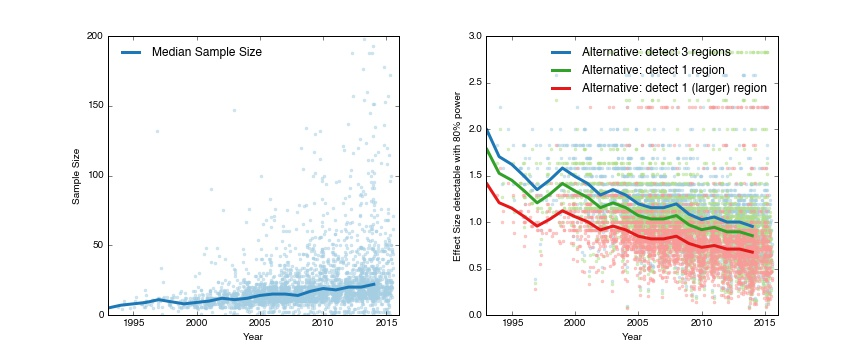

# RequiredEffectSize

In this repository, we give intuition about the sample sizes used in neuroimaging studies, and which effect sizes are generally detectable with these sample sizes.

The repository consists of two parts:
- **FIG_samplesize_year**: contains the code to make the figure of which effect sizes are detectable with median sample sizes per year.
- **HCP_group_effect_sizes**: contains the code to construct a table with effect sizes of some common experimental paradigms.  

